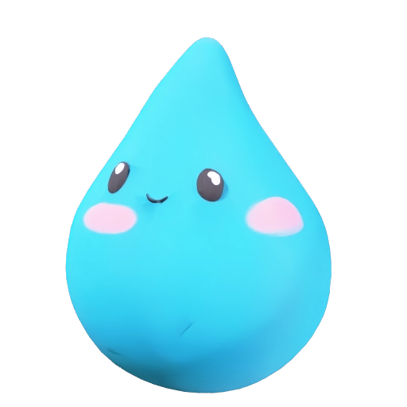
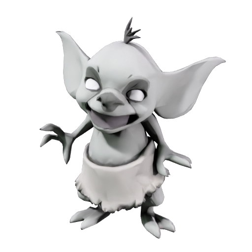
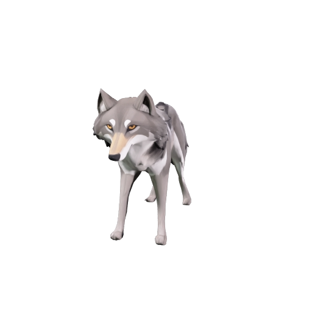
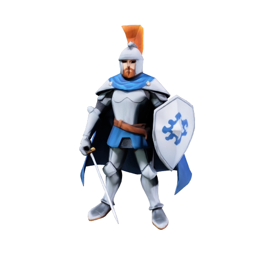
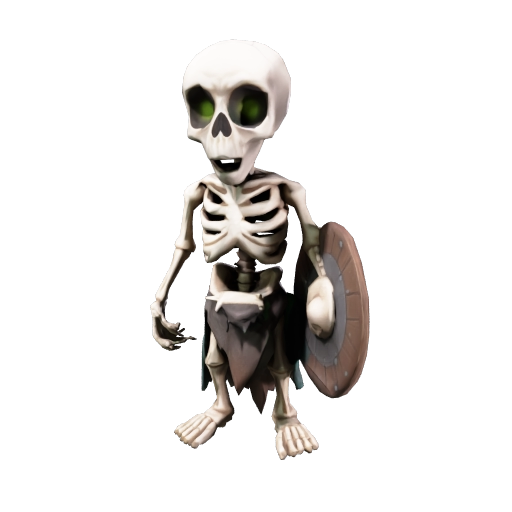
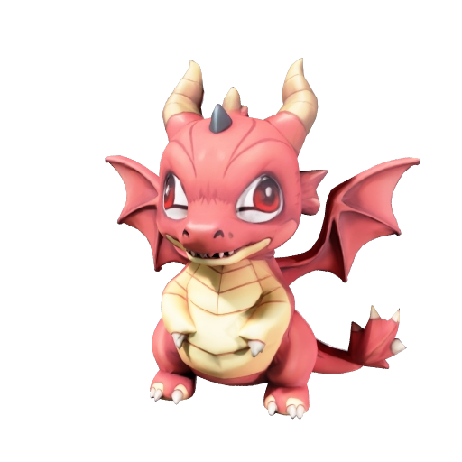

# Living Diorama

A tiny world on a shelf that lives without you.

You do not control the creatures. You open a mystery box, set whoever comes out down on
the diorama, and watch. The goblin steals from the larder. The wolf notices the goblin.
The knight notices the theft. The slime, oblivious, plays in the river. The skeleton
sleeps through all of it and gets up at dusk. Everything you see happening was decided by
the creatures, not scripted for you.

Android, 3D, fully offline. No account, no backend, no network calls at runtime.

<p align="center">
  
  
  
  
  
  
</p>

---

## The loop

Open a box → set the creature down → watch what it does to everyone else → earn from the
moments you witness → buy more ground → unlock a new biome → open a better box.

Expansion is not decoration: each tile raises the creature limit, and a bigger, more
mixed population is what produces more interesting collisions between species.

## How the ecosystem actually works

The interesting design decision is that **nothing is scripted per species.**

Each creature carries traits — `predator`, `mischief`, `lawful`, `undead`, `apex`,
`critter` — and a single rule set turns pairs of traits into an attitude:

```
predator  →  mischief   : Predatory   (the wolf hunts the goblin)
lawful    →  thief      : Hostile     (the knight goes after whoever just stole)
critter   →  predator   : Fearful     (the slime bolts)
anyone    →  apex       : Fearful     (everything gives the dragon room)
```

Stealing from the larder attaches a temporary `thief` trait to the culprit, which is what
turns the knight hostile — not a line of code that mentions goblins. Add a creature
tagged `predator` next month and the whole food chain rearranges itself around it for
free. Size does its own work on top: anything two size classes larger is feared without a
rule, unless the observer is brave enough to only be wary.

On top of that sits a **utility AI**. Ten behaviours score themselves 0–1 every tick —
idle, wander, sleep, seek food, flee, chase, attack, socialise, play in water, steal — and
the highest wins, with hysteresis so creatures commit instead of dithering. Needs
(fullness, energy, social, fun) decay on an in-game clock, and a day/night cycle gates who
is awake, which is why the skeleton feels genuinely different from the goblin without a
single line of skeleton-specific behaviour.

Brains run at 8 Hz spread across four buckets; movement integrates every frame. Neighbour
queries go through a uniform spatial hash rather than physics, so the frame cost stays
flat as the population grows.

## Adding a creature

By design, this takes no code:

1. drop a `.glb` into `Assets/StreamingAssets/Creatures/`
2. create a `Creature` asset (`Assets > Create > Living Diorama > Creature`), point
   `streamingModelFile` at the file, tick some traits
3. add it to a box pool

The model is loaded at runtime with glTFast, auto-scaled to its authored body height,
re-skinned onto the shared stylised shader, and animated procedurally — so a brand new
mesh with no skeleton and no clips walks, hops, breathes, eats and recoils on arrival.
`Tools/meshy_pipeline.py` generates step 1 from a text prompt if you want one.

## Presentation

- **Everything is generated.** Terrain, soil strata, the display plinth, trees, rocks,
  grass, mushrooms, crystals, the mystery chest, the mood icons and the particle sprites
  are all built in code at runtime. No prop library ships with the game.
- **Custom toon shaders** — banded lighting with wrapped subsurface, rim light and a hard
  specular for creatures; vertex-coloured faceted terrain; depth-faded water with a lacy
  foam shoreline; foliage that shares one wind gust across the whole diorama.
- **It is a diorama, not a landscape.** Each tile is a solid slab with visible soil strata
  down its cut sides, sitting on a stepped plinth. You orbit it, pinch to zoom, and can
  leave it on a slow turntable like a piece in a display case.
- **Cinematic unboxing.** The camera cuts to a lit stage above the world, the chest
  shakes three times with the seam glowing brighter each time, the lid is flung off in a
  burst of light and sparks, and the creature rises out of it and materialises. Rarity
  drives the colour, the light, the spark count and the length of the hold.
- **Narrated.** A storyteller introduces the world, walks you through the first five
  minutes, and occasionally remarks on what your creatures have got up to. Subtitled,
  and every line ducks the ambience underneath it.

## Running it

Requires Unity **6000.3.20f1** with the Android build module.

```bash
git clone https://github.com/fareza777/living-diorama-3D.git
```

Open the project, then run **Living Diorama > Rebuild Everything** once. That generates
the render pipeline asset, the UI panel settings, the scene, and every creature, biome and
box asset from code, then configures the Android player settings.

Build an APK from **Living Diorama > Build Android APK**, or headlessly:

```bash
Unity.exe -batchmode -quit -projectPath . \
  -executeMethod LivingDiorama.EditorTools.AndroidBuilder.BuildFromCommandLine \
  -outputPath Build/LivingDiorama.apk
```

### Tests

```bash
Unity.exe -runTests -batchmode -projectPath . -testPlatform EditMode \
  -testResults Build/test-results.xml
```

Covers the box odds and pity guarantees, the trait-based relation rules, the progression
curves, offline earnings, terrain determinism and tile seaming, and save round-tripping.

## Asset pipelines

Optional — the repository already contains everything they produce. All three read keys
from a local `.env` (see `.env.example`); **nothing in the shipped game talks to a
network**.

| Script | What it makes |
|---|---|
| `Tools/meshy_pipeline.py` | Creature meshes from text prompts (Meshy) |
| `Tools/elevenlabs_pipeline.py` | Narration, sound effects, biome ambience (ElevenLabs) |
| `Tools/replicate_ui_pipeline.py` | Interface icons, panel and button plates, emblem (Replicate) |

Each is resumable and skips anything already on disk, so re-running never re-spends
credits.

## Ads

There is a deliberately small amount of advertising, behind an interface with a stub
implementation that grants rewards immediately, so every reward flow is playable and
testable without a plugin or a network:

- **Rewarded** — a free box open on a cooldown, and doubling the offline earnings on the
  welcome-back screen. Both are opt-in and both give something the player actually wants.
- **Interstitial** — only after a box opening, only every sixth one, never within four
  minutes of the last, and never in the first ninety seconds of a session. This is a game
  about sitting and watching; an ad that interrupts that costs more than it earns.

To use the real thing: import the
[Google Mobile Ads Unity plugin](https://github.com/googleads/googleads-mobile-unity/releases),
set your app id, put your unit ids in `Assets/Scripts/Ads/AdIds.cs`, and add `LD_ADMOB`
to the Android scripting define symbols. The ids currently committed are Google's public
test ids.

## Layout

```
Assets/
  Art/Shaders/          toon creature, terrain, water, foliage, additive glow
  Editor/Pipeline/      content generation, project configuration, Android build
  Resources/            game database, UI markup and stylesheet, audio, interface art
  Scripts/
    Ads/                ad interface, stub, pacing, AdMob behind a define
    Audio/              music, ambience, ducked narration, one-shot pool
    Core/               bootstrap, application services, quality tiers
    Data/               ScriptableObject definitions and the tag rule set
    Diorama/            terrain noise, tile meshes, procedural props, the plinth
    Meta/               loot rolls, wallet, levels, offline progress
    Presentation/       procedural animation, camera, day/night, generated textures
    Save/               versioned JSON with atomic writes and a backup
    Simulation/         agents, utility AI, behaviours, perception, world clock
    UI/                 title, HUD, collection, boxes, expansion, onboarding
    Unboxing/           the reveal stage and its director
  StreamingAssets/
    Creatures/          creature GLBs, swappable without a rebuild
  Tests/EditMode/
Tools/                  the three asset pipelines
```

## Credits

Creature meshes generated with [Meshy](https://www.meshy.ai). Narration and sound
generated with [ElevenLabs](https://elevenlabs.io). Interface art generated with
[Replicate](https://replicate.com). Everything else — terrain, props, shaders, icons,
animation — is generated procedurally at runtime.
